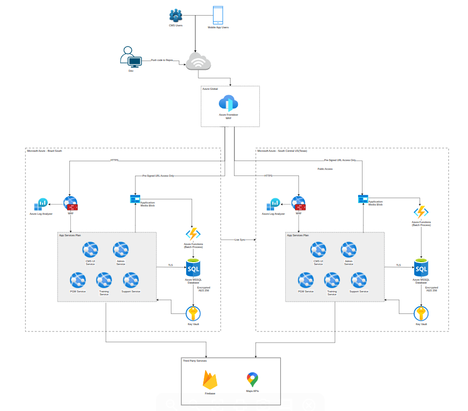
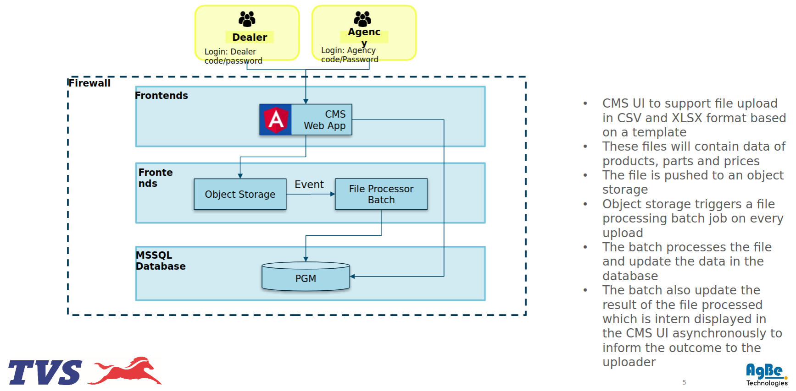
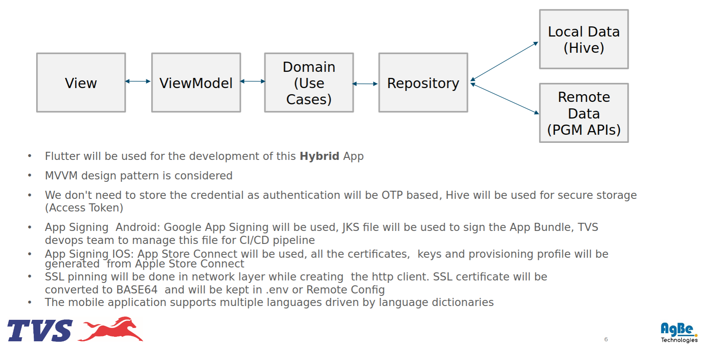
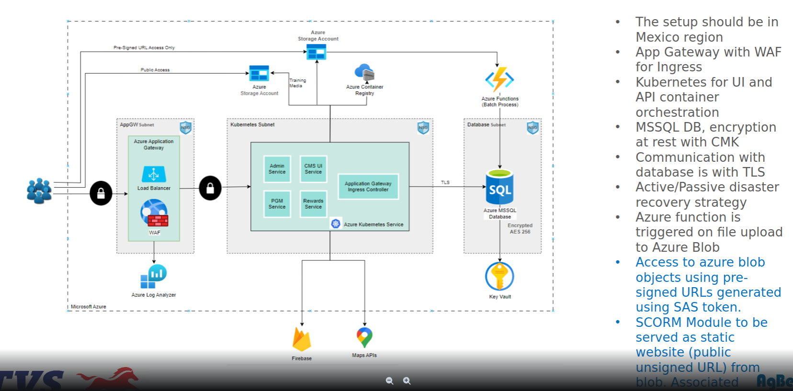
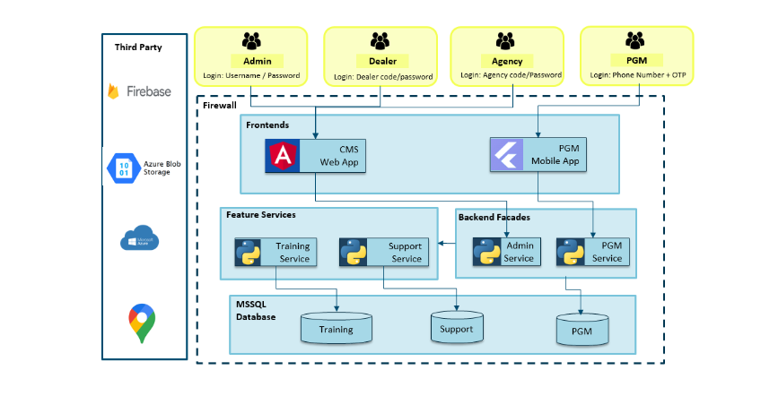

# TVS PGMIB PROJECT POC

## Non Technical(`Overview of PGM APP`)

### What is PGM
- Application helps mechanic to purchase genuine TVS parts

### Why we need PGM
- Encourage mechanics to buy genuine parts.

### User journey

- Mechanic login/signup
    - Shows homepage
        - see parts catalogue
        - see training section
        - see reward catalogue section
        - see support section
        - see referral section
        - see accessories catalogue
        - see referral section
    - select parts from parts catalogue
    - locate the dealer store selling the selected parts i.e spain and mexico regions
    - scan parts to check whether part is genuine or not
    - purchase the parts - `??`
    - refer and reward shows list of referrals and reward earned for that referalls
    - shows training resources for selected parts 

### Features
- Buy genuine parts
- loyality points reward
- parts catalogue
    - contains list of products and information of all the parts needed to create that product which help mechanic in searching a part for particular product
    - `Example`: engine oil,tyres in a bike
- accessories and merchandise
    - contains list of products and information of all the additional parts(`which tvs doesn't manufacture`) needed for a product which help mechanic in searching a part for particular product
    - `Example`: helmet,matting,safety guards in a bike
- training management
    - information related to parts and future launches
- Rewards program
- store list of mechanics who have bought products from the app and also the information about the dealer from whom he has purchased the product
- Support & announcement
- Referral program
- multi language support
- role based access control for security

## Technical(Architecture && TECHSTACK && TESTING  && DEPLOYMENT)

### Architecture

 

 

`Microsoft Azure Frontdoor WAF`
- It is a security service to protect web app from malicious attacks using pre-defined rules

`Azure log analyser`
- Provides additional logging capabilities for incoming http request to frontdoor WAF.

`Application media blob`
- It represents the data which will be used by the application.
- This data is stored in Azure blob storage
- Access is provided through pre signed url's generated using SAS token

`Azure functions(blob process)`
- These are the serverless services used to run event driven code without managing infrastructure.
- In the context of blob process it means azure function will run when a new file is added or modified in azure blob storage.

`App gateway with ingres`
- It is way to configure external access to the microservices without exposing them directly to the internet or managing individual external IP addresses.

`MSSQL Database`
- MSSQL: Microsoft sql server
- RDBMS software which we will use for handling relational data

`AES 256`
- Algorithm which will be used to secure sensitive data
- It will encrypt sensitive data

`Key vault`
- Cloud service provided by Azure
- Stores sensitive information of app

`Firebase`
- It is a platform developed by google
- It provides range of services
- It offers tools for app development, including backend services, database management, authentication, analytics, and more.
- It will be used as notification layer in our app

`Maps api`
- It provides tools to integrate maps into application

`Active/passive disaster recovery startegy`
- It is a strategy which is used to minimise downtime in case of failure in production server
- The production server is known as active server
- The backup server is known as passive server
- In case of failure in production server system switches to passive server

`TLS`
- Its stands for transport layer security
- It is security mechanism which is used to protect messages when they travel through interenet.
- It encypts the message

### Project Dependencies
- `plivo`
    - Used to integrate communication functionality such as voice call and sms
    - To access api's,we need to create a plivo account

### Dataflow for parts

 

### Design pattern

 

- For designing the application MVVM desgin pattern is used
- Invented by microsoft
- MVVM design pattern is used in application to create a clear distinction between UI and business logic
- Let's understand different component of it
    - View : contains UI and presentational logic
    - Model : contains data,business and validation logic
    - ViewModel
        - It acts as a link between view and view models
        - fetches data from model and send to view
        - Handles user interaction
        - Interacts with view using data binding
- `Hive`
    - It is a tool to store,manage and query large datasets
    - Store access token

- `SSL pinning`
    - SSL stands for secure socket layer
    - It ensures that application only interacts with trusted server having valid certificate

### Deployment architecture

 

`NSG Subnet`
- Dividing a large network into smaller group of network
- NSG specifies role  for each network
- It help to provide granular control over security and handle traffic in each subnet
- Current application is divided into 3 subnets
    - AppSGWubnet
    - Kubernets subnet
    - Database subnet

`Azure container registry`
    - It is a azure service which is used to store and manage docker images within azure ecosystem
    - In our case they are azure kubernetes services

`Kubernetes`
    - Open source platform to automate deployment,scaling and storing of containerized application

### Technologies High level diagram

 

`Scorm Module`
    - It stands for Shareable Content Object Reference Model, is a set of technical standards used in e-learning and online training to ensure that learning content (referred to as "learning objects") can be easily shared across different learning management systems (LMS).
    - It help in serving training material to PGM users.
    - It is stored in azure blob storage
### Services
- `Rest` architecture is used to create services
- `Swagger` is used for api documentation

### Entities | Schema

### CONFIG DRIVEN UI ACCORDING TO COUNTRY
`Entities dependent on country`
- country_translation
- vehicle
- verification_document
- dealer
- country_language_map
- users
- country_vehicle_category_mapping
- role_country_mapping
- order
- part
- privacy_policy_config
- distributor
- questionaire_country_mapping

### Requirements gathering to decide whether we should use server driven or config driven UI for below dynamic data
- locate nearby dealer stores according to region
- availability of dealer store
- opening and closing time of dealer stores
- training program tailored for each mechanic
- reward program tailored for each mechanic
- order management
- parts availability
- language tailored for region
- app updates are less painful

### Testing 
- Security testing
- feature testing
- Zephyr software for testing

## Doubts
- Right now do we have order functionality in app
- Is the PGM mobile app live
    - If yes on which feature we need to work
    - If not do we need to develop app from scratch
- Is the PGM web app live
    - If yes on which feature we need to work
    - If no do we need to develop the app from scratch
- What type of data is stored in azure storage and database
    - parts,product and training material data
- Does mechanic can buy parts from PGM app or it is only used to locate the TVS genuine parts
- Who are CMS users
    - who have access to create and update content using CMS UI 
- Why we are using 2 cloud service providers i.e azure and firebase
- Is the country rollout plan released
    - If yes then we to customize app according to selected country

